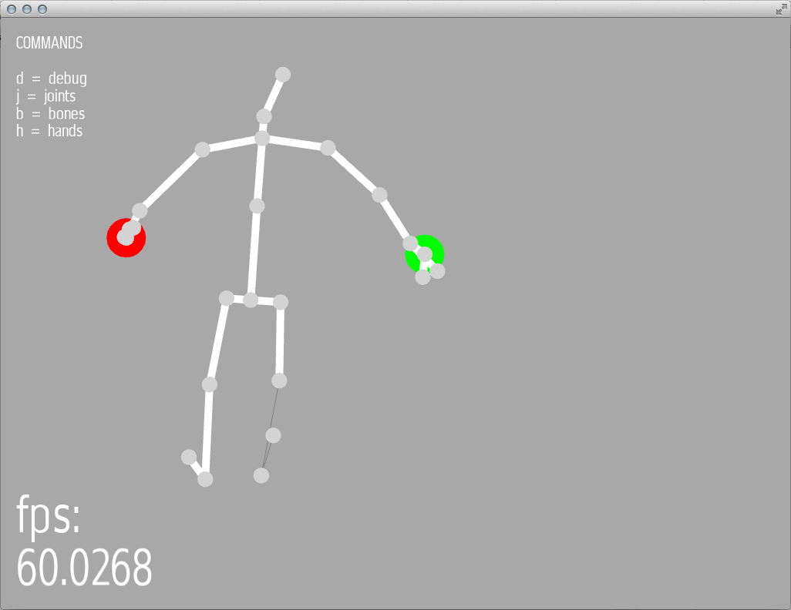

ofxKinectV2-OSC
===============
Easily get the [Kinect V2 sensor](http://www.microsoft.com/en-us/kinectforwindows/purchase/)'s realtime skeleton data into openFrameworks on a Mac.

If you are used to using openFrameworks on a Mac, **and all you want is skeletal data**, this addon is for you.

You still need Windows
----------------------
For the foreseeable future, the Kinect V2 sensor runs only on Windows using a USB3 port. There's no way around that, but what you can do is have a small, simple program on your Windows computer, which broadcasts to a Mac.

Then you can just leave Windows running and get back to doing the rest of your coding on a Mac. The Windows and Mac computers will of course have to be on the same network.

Instructions
------------
- On your Windows machine, download and run [KinectV2-OSC.exe](https://github.com/microcosm/KinectV2-OSC/releases/download/v0.1.0/KinectV2-OSC.zip) (based on [this repo](https://github.com/microcosm/KinectV2-OSC))
- Edit the file `ip.txt` to specify the IP addresses you want to broadcast to (or ignore this step if you are broadcasting back to the same machine on `127.0.0.1` which is the default)
- That will broadcast the Kinect's skeletal data across the network from Windows
- Over on your Mac, clone and run ofxKinectV2-OSC (this repo)
- Once you fire up the example, you should see a skeleton that looks a bit like you!

Screenshots
-----------
This is what you'll see on your Windows machine:

This is what you'll see on your Mac:

See the red and green hands? That's showing detection of open or closed hand states.

And the thin lines on the legs? That's where the bones are inferred (low confidence).

Project dependencies
--------------------
- [ofxOSC](https://github.com/openframeworks/openFrameworks/tree/master/addons/ofxOsc) to recieve messages - it's part of the openFrameworks core
- Tested against [openFrameworks 0.10.0](http://openframeworks.cc/download/)